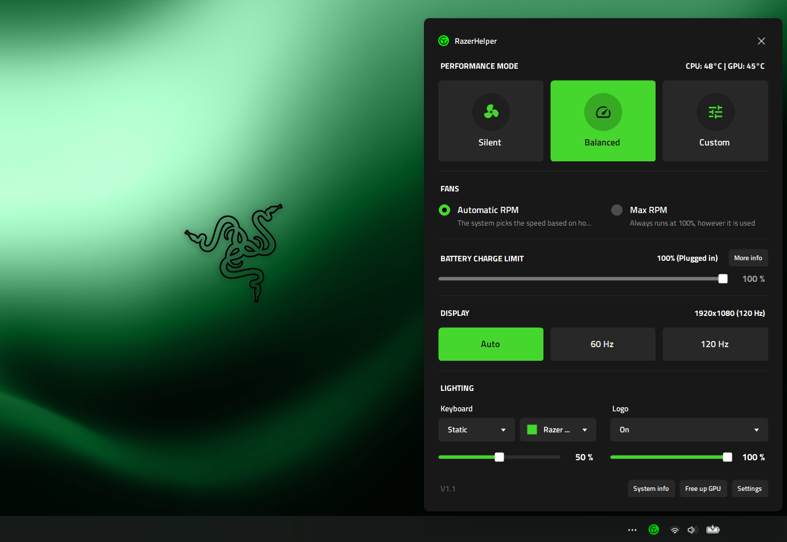
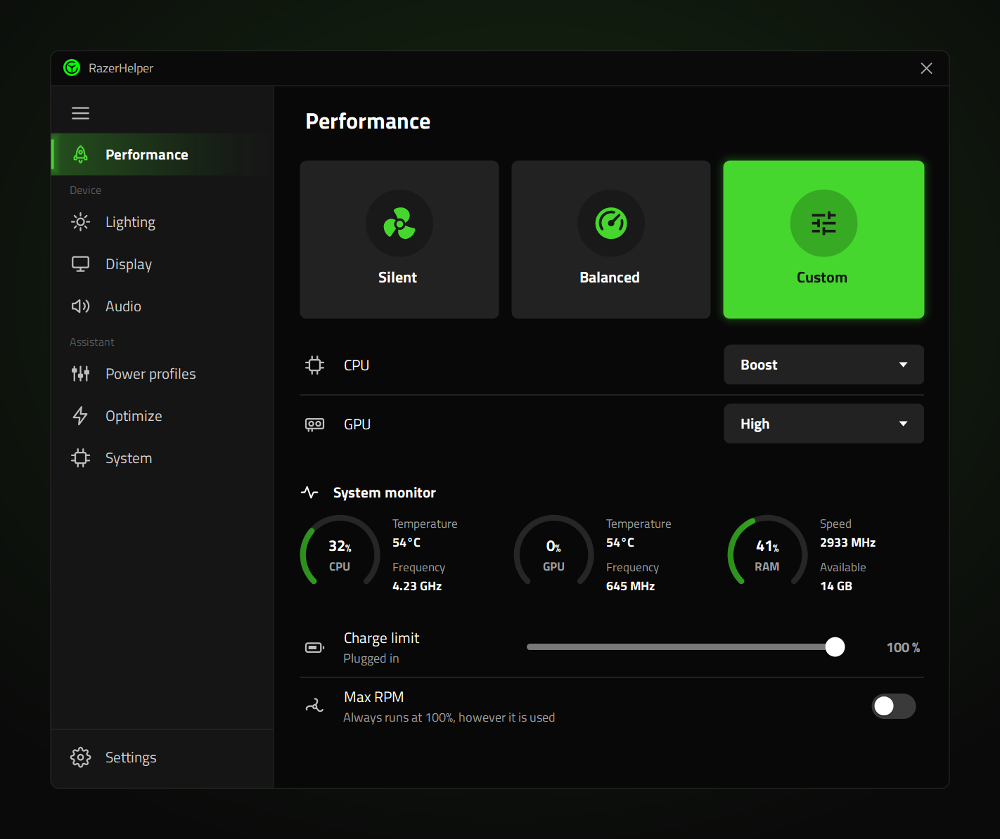
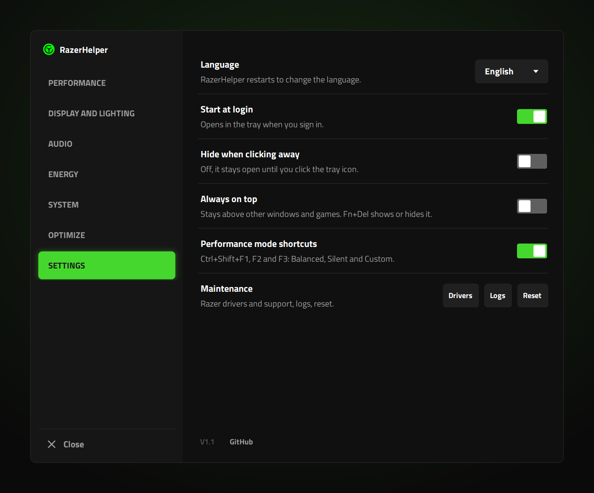

<p align="center">
  
</p>

<h1 align="center">RazerHelper</h1>

A lightweight, open-source replacement for Razer Synapse on Razer Blade laptops.

It lives in the system tray, talks to the laptop's controller directly, and needs no account, no cloud and no background services of its own.

> **This is a fork.** RazerHelper was created by **Paul Rodriguez**: the original project is [Paulrod20/razer-helper](https://github.com/Paulrod20/razer-helper), and all credit for the app and its design goes to him. This fork, **Razer-Helper-New-UI**, adapts it to the **Razer Blade 15 Base (2020)** and adds a Spanish translation, a redesigned interface and a few new windows; see [What this fork changes](#what-this-fork-changes), the [CHANGELOG](CHANGELOG.md), or every change side by side in the [comparison with the original](https://github.com/Paulrod20/razer-helper/compare/main...jdsgnrinfo:razer-helper:main).

> **Status: v1.0.** Built and tested on a **Razer Blade 16 (2023)** running Windows 11. A few other Blade models are recognized from their product ID and will run the same commands, but are not independently verified; see [Requirements](#requirements). This project is not affiliated with Razer.

## Preview

<p align="center">
  
</p>

On the desktop, with the Custom mode's CPU and GPU levels open beside the window, and with Settings:

<p align="center">
  
</p>

<p align="center">
  
</p>

The tray icon takes the color of the current performance mode, and hovering it names the mode, as in "RazerHelper (Silent)":

<p align="center">
  
</p>

## What this fork changes

Everything the original does still works the same way; on top of it:

- **Razer Blade 15 Base (2020) support**, tested on the laptop itself: Max fan through the model's manual fan method, and keyboard colors. Features the firmware does not really support (charge limit, the max fan flag) are marked unavailable instead of pretending to work.
- **Spanish translation**, chosen in Settings (English stays the default).
- **Performance mode shortcuts:** Ctrl+Shift+F1/F2 switch to Balanced and Silent from any program, with a small notice at the top right.
- **Tray icon in the mode's color:** green for Balanced, blue for Silent, purple for Custom, and "RazerHelper (Silent)" on hover.
- **Dark tray menu:** the right-click menu of the tray icon in the app's dark style, with rounded corners.
- **Three performance modes on every model:** Balanced, Silent and Custom, which now carries the game controller icon. Gaming is no longer offered; a profile saved with it is applied as Custom.
- **Redesigned interface:** a flatter, more compact look for every window, rounded corners from Windows 11, and new icons.
- **Custom window:** Custom mode's CPU and GPU levels open in their own window, with live CPU (temperature, usage, speed) and GPU (temperature, usage, core and memory clock) figures.
- **Battery details window** (More info): power in or out, time left, charge, health, voltage.
- **System information window** (System info, in the footer): Windows, CPU, integrated and dedicated GPU, RAM, drives with their space, and BIOS.
- **Keyboard off with the screen** (optional, in Settings).
- **Experimental:** on the Blade 15 Base (2020), Max fan asks the controller for 10000 RPM (the original asks for 7000). The fans cannot go beyond their own maximum either way; this is being tested and may go back to 7000.

## What it does today

- **Performance modes:** Balanced, Silent and Custom, with CPU and GPU boost levels in Custom, on every model.
- **Power profiles:** separate settings for plugged in and on battery, applied automatically when you plug or unplug. On battery Balanced and Silent are offered (Synapse offers only Balanced); Custom needs the charger.
- **Battery charge limit:** 60%, 80% or 100% (no limit).
- **Display refresh rate:** 60 Hz, 120 Hz, or Auto, which follows the power source.
- **Temperatures:** CPU and GPU, shown at the top to the left of the power source, only while the window is open. The GPU reading comes from the graphics driver (the same source Task Manager uses). The CPU reading comes from the laptop's own controller. Compared with MSI Afterburner under load on the developer's laptop it was very close, but it updates more slowly, so Afterburner's number moves faster (hover it for a reminder). It is not read from the CPU die itself. The GPU is read every 2 seconds and the CPU every 4, and nothing is read while the window is closed.
- **Fans:** live CPU and GPU fan speed, and **Max** fan speed (both fans flat out). Max is a one-off that needs AC power and, on most models, Custom mode; **Auto** turns it off, and it clears by itself when you change mode. On the Blade 15 Base (2020) it runs both fans at full power through their manual setting instead, which works in any mode but Silent.
- **Lighting:** the keyboard backlight (Off, Static green, Spectrum, Wave, Breathing) and the Razer logo on the lid (Off, On, Breathing), each with a brightness slider. Always available, on battery or plugged in.
- **Razer background services:** shows how many are running, and can stop and restore them (see below).
- **Tray icon:** its disc takes the color of the current mode (green Balanced, blue Silent, purple Custom), and hovering it names the mode, as in "RazerHelper (Silent)". A mode changed outside the app (the laptop's own keys, Synapse) shows once the window is next opened.
- **Keyboard shortcuts**, in any program, even a game: **Fn+Del** shows or hides the window, and **Ctrl+Shift+F1 / F2** switch to Balanced and Silent with a small notice at the top right (see [Keyboard shortcuts](#keyboard-shortcuts)).
- **Settings** (button at the bottom right): start at login, switch profile automatically when you plug in or unplug, hide the window when you click away, keep it always on top, close apps using the dedicated GPU when you unplug (see below), shortcuts to Razer's drivers and support page and to the log folder, and **Reset to defaults**.

**Reset to defaults** (in Settings) puts the app back the way it was the first time you opened it, if something ever seems stuck. After you confirm, it clears your saved settings, turns off Start at login, sets the laptop to Balanced mode with no battery charge limit, and restarts. It does not touch Razer's background services (the record of what they were set to is kept, so Start can still restore them) or anything else on your PC.

## Keyboard shortcuts

They work in any program, even a game, and are always on: no setting needed.

| Shortcut | What it does |
| --- | --- |
| **Fn+Del** | Shows the window, or hides it if it is in front |
| **Ctrl+Shift+F1** | Switches to **Balanced** |
| **Ctrl+Shift+F2** | Switches to **Silent** |

### Open it from anywhere

Press **Fn+Del** in any program, even a game, to bring the window to the front, and press it again to hide it. On the Blade, Fn+Del sends the Insert key, so that is what the app listens for; it is always on and needs no setting.

- It costs nothing when unused: Windows hands the key press to the app, so nothing watches the keyboard.
- While RazerHelper runs, Insert no longer toggles overwrite mode in editors. If another program already uses the key, the window says so at the top.
- **Always on top** (in Settings) keeps the window above other windows, including games in a borderless window. A game in true exclusive fullscreen can still cover it, and opening the window may make such a game minimize, because the window takes focus. That is how Windows treats exclusive fullscreen; borderless and windowed games are not affected.

### Switch performance mode from anywhere

**Ctrl+Shift+F1** and **F2** switch to Balanced and Silent, as clicking their buttons would, without opening the window.

- A small notice at the top right of the screen shows the mode's icon, its name and how it went: "Active" (green icon), or why not (grey icon), such as "Needs to be plugged in" or "Not supported on this laptop".
- It never takes the focus from the game or program in front, and fades out after two seconds. In a game in exclusive fullscreen Windows draws nothing over it, so the mode still changes but the notice is not seen; in windowed or borderless fullscreen it shows.
- Like Fn+Del, they cost nothing when unused. If another program already uses one, the window says so at the top and the others still work.
- They are on from the start. To free them for another program, or if you would rather not have them, turn off **Performance mode shortcuts** in Settings.
- Why not Fn+1/2/3: the Blade's Fn key never reaches Windows, so Fn+1 looks exactly like 1, and every typed number would switch mode.

## Light on resources

It sits in the tray and does nothing until you open it. Its only timer, which reads fan speeds and temperatures, runs only while the window is open and stops when it is hidden, so the laptop is not polled while the window is closed. It only acts on events, such as plugging in or unplugging. Results are reused so the laptop's controller is not asked twice for the same thing. Measured on the developer's machine, the installed app uses about 18 MB of private memory (about 73 MB of working set, which includes memory shared with the .NET runtime) and 14 threads. It uses one small dependency (for Windows services) and installs no driver.

## Not yet

Manual fan control, the CPU overclock toggle, independent verification on any Blade but the one in [Requirements](#requirements), and Razer mice, keyboards and headsets.

**The CPU die temperature is not shown.** Windows does not expose it without a kernel driver (its own thermal zones on this laptop are fixed values that do not move under load), and razer-helper deliberately installs no driver. The CPU figure above comes from a sensor in the laptop's controller instead. It was found by scanning the controller's read-only commands on a Blade 16 (2023), is not documented anywhere, and other Blade models may not have it (the app then simply shows no CPU temperature).

**Choosing a keyboard color is only available on the Blade 15 Base (2020), and per-key lighting on none.** On that model a static color of your choice is sent with the older "standard" lighting command, which it shows in normal mode; pick it from the color list that appears next to the keyboard effect while it is on **Static** (white, Razer green and seven other colors); **Breathing** takes the chosen color too. Its keyboard is a single zone, so there is no Wave. On the Blade 16 the laptop only honors a chosen color in a "driver mode" that also switches off the Fn media keys (volume, screen and keyboard brightness), and razer-helper does not trade those away. In normal mode a static effect always shows Razer green, which is why the option is called **Static green**. Effects the laptop does not run on its own, such as Wheel, are not offered either. The built-in effects listed above are the ones the laptop runs by itself.

## Closing apps that use the dedicated GPU

An app that keeps the dedicated GPU awake drains the battery. There are two ways to deal with that:

- **Free up GPU** (link at the bottom of the window) lists those apps and asks whether to close them. Use it whenever you like, plugged in or not, for example after unplugging an external monitor.
- **Close apps using the dedicated GPU when unplugged** (in Settings, off by default) does the same automatically when you unplug the charger.

It is deliberately cautious:

- **It always asks first**, and the default answer is "Not now". After an unplug, if you plug the charger back in, the question goes away.
- **It never force-closes anything.** It asks each app's main window to close, the same as clicking the X, so an app with unsaved work can still ask you to save.
- **It does nothing while an external display is connected.** On this laptop the external ports are wired to the dedicated GPU, so it stays on regardless of which apps are closed.
- **It leaves alone** Windows itself, graphics drivers, Razer software, this app, other users' processes, background helpers with no window, and terminals, editors and the Claude desktop app.
- **Your own never-close list:** add program names to `NeverCloseApps` in `%LOCALAPPDATA%\RazerHelper\settings.json`, for example `"NeverCloseApps": ["blender", "obs64"]`. Names are the process name without `.exe`.

## Window size

The window is drawn a little larger on high-resolution screens so it stays easy to read: it grows a quarter as fast as Windows' own display scaling (for example about 30% larger at 225% scaling, and unchanged at 100%). To choose your own size, add `"WindowScale"` to `%LOCALAPPDATA%\RazerHelper\settings.json` (for example `"WindowScale": 1.5`; allowed range 0.75 to 3) and restart the app. Remove it to go back to the automatic size.

## Requirements

- Windows 11
- A supported Razer Blade, found by USB product ID:

  | Model | USB product ID | Verified |
  | --- | --- | --- |
  | Razer Blade 16 (2023) | `0x029F` | Yes, on the developer's own unit |
  | Razer Blade 15 (2022) | `0x028A` | No — community-reported ID only |
  | Razer Blade 14 (2023) Mercury | `0x029D` | No — community-reported ID only |
  | Razer Blade 16 (2024) | `0x02B7` | No — community-reported ID only |
  | Razer Blade 16 (2025) | `0x02C6` | No — community-reported ID only |
  | Razer Blade 15 Base (2020) | `0x0255` | Yes, on the UI designer own unit |

  An unverified model runs the exact commands documented in [Credits](#credits); one the firmware does not support simply fails instead of doing something unexpected. If you have one of these and something looks wrong, please [open an issue](https://github.com/jdsgnrinfo/razer-helper/issues) — the log (Settings > "Logs") says which model was detected.
- The [.NET 10 Desktop Runtime](https://dotnet.microsoft.com/download/dotnet/10.0) (choose ".NET Desktop Runtime" for x64). The installer checks for it and will not install without it.

## Install

1. Install the [.NET 10 Desktop Runtime](https://dotnet.microsoft.com/download/dotnet/10.0) if you do not have it.
2. Download `RazerHelper-Setup-<version>.exe` from the [Releases page](https://github.com/jdsgnrinfo/razer-helper/releases) and run it. It installs for your user only and does not ask for administrator rights.
3. Start RazerHelper from the Start menu. It lives in the tray; click the icon, or press **Fn+Del** from any program, to open it.

The installer and the app are not code-signed, so Windows SmartScreen may say "Windows protected your PC" (click **More info**, then **Run anyway**), and Windows will show "Unknown publisher" when the app asks for administrator approval. To remove RazerHelper, uninstall it from Windows Settings > Apps; that also removes its start-at-login entry. Your settings stay in `%LOCALAPPDATA%\RazerHelper` until you delete that folder.

## Build from source

To run from source:

```
git clone https://github.com/jdsgnrinfo/razer-helper.git
cd razer-helper/src/RazerHelper
dotnet run
```

To run the tests (they use a fake laptop, so no hardware is needed):

```
cd src/RazerHelper.Tests
dotnet test
```

To build the installer yourself (needs the .NET 10 SDK and [Inno Setup 6](https://jrsoftware.org/isinfo.php)):

```
installer\build.ps1
```

It publishes the app as a single exe and writes `dist\RazerHelper-Setup-<version>.exe`.

## Razer Synapse and Razer's background software

Razer's software runs several background services that use memory and can contend with this app for the laptop's controller. razer-helper gives you two ways to deal with that.

**Stop them from the app.** When Razer's software is installed, the bottom of the window shows `Razer Software Running: N` (its services plus its own programs, such as Synapse) with a **Stop** button. Hover the number to see exactly what it counts (services, programs, and whether Razer starts at login) and when it was last checked.

- Stop asks Windows to stop every Razer service and turns off their automatic startup, so they stay off after a restart. Windows asks for administrator approval, but only when there are services left to stop.
- Stop also **turns off Razer's start-at-login entry**, the same as switching it off in Task Manager's Startup tab. Razer's own entry is left in place; only its on/off switch changes.
- Stop **asks Razer's running programs to close**, the same as clicking their X. Nothing is force-closed. Synapse lives in the tray and may ignore the request; quit it from its tray icon.
- **Start** restores each service to exactly the startup type it had before, and puts the login entry's switch back exactly as it was.
- Nothing runs automatically. The app only changes these when you press the button, and it never deletes or uninstalls anything. This app's own start-at-login entry is never touched.

**For the cleanest experience, uninstall Razer Synapse.** Removing it takes away Razer's background services, its startup entry and its helper processes in one step, instead of switching them off. It is optional.

Before you do:

- Synapse is also how Razer **mice, keyboards and headsets** are configured (button remapping, macros, lighting effects, DPI). Those features go with it.
- razer-helper controls the laptop directly and does not use Synapse. It has so far been used with Synapse installed, **not yet with Synapse fully uninstalled**. If you try it, create a Windows restore point first, and please report how it went.
- Leave Razer's drivers alone. They are part of how Windows talks to your keyboard hardware, not background apps.

## How it works

The app sends commands to the laptop's embedded controller over a standard Windows HID interface, found and opened with Windows' own device APIs (no third-party HID library). The command set was worked out by the community; see the credits below. Writes are checked: the controller echoes what it accepted, and the app treats anything else as a failure.

## Credits

- **RazerHelper** was created by [Paul Rodriguez](https://github.com/Paulrod20) ([original project](https://github.com/Paulrod20/razer-helper)). This fork, by [jdsgnrinfo](https://github.com/jdsgnrinfo), builds on his work.
- [razer-ctl](https://github.com/tdakhran/razer-ctl) by tdakhran, and its actively maintained continuation [sqmagellan/razer-ctl](https://github.com/sqmagellan/razer-ctl) (MIT): the documented Blade command set this project builds on.
- [OpenRazer](https://github.com/openrazer/openrazer): the USB protocol reverse-engineering work behind all of the above.
- [G-Helper](https://github.com/seerge/g-helper): inspiration for the approach to power profiles and service handling. No G-Helper code is used.
- App icon and logo by [jdsgnrinfo](https://github.com/jdsgnrinfo).
- Interface icons (this fork), drawn from their published SVG paths:
  - [Boxicons](https://boxicons.com) (MIT): rocket, leaf, widget and cog.
  - [Phosphor Icons](https://phosphoricons.com) (MIT): fan, battery charging, frame corners and laptop.
  - [Ionicons](https://ionic.io/ionicons) (MIT): game controller.
  - [Material Icons](https://fonts.google.com/icons) by Google (Apache 2.0): twilight.

## Disclaimer

This app changes how your laptop behaves: it writes to the laptop's embedded controller, and it can stop and disable Windows services. It only sends commands that were verified on a Blade 16 (2023), but **you use it at your own risk.**

This software is provided "as is", without warranty of any kind. **The author is not responsible for anything that breaks, stops working, or is lost as a result of using it**, including damage to your laptop, changes to performance, battery or thermal behavior, problems with Razer software or Razer devices, or data loss. This is the same no-warranty and no-liability position the [MIT license](LICENSE) already sets out; this section is a plain-language reminder of it. If that isn't acceptable to you, please don't use the app.

## Trademarks

Razer, the Razer logo, Razer Synapse and Blade are trademarks of Razer Inc. They are used here only to say which laptops and software this project works with. RazerHelper is an independent project; it is not made, endorsed or supported by Razer, and its icon is not Razer's.

## License

[MIT](LICENSE)
